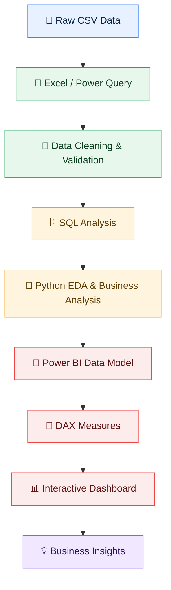
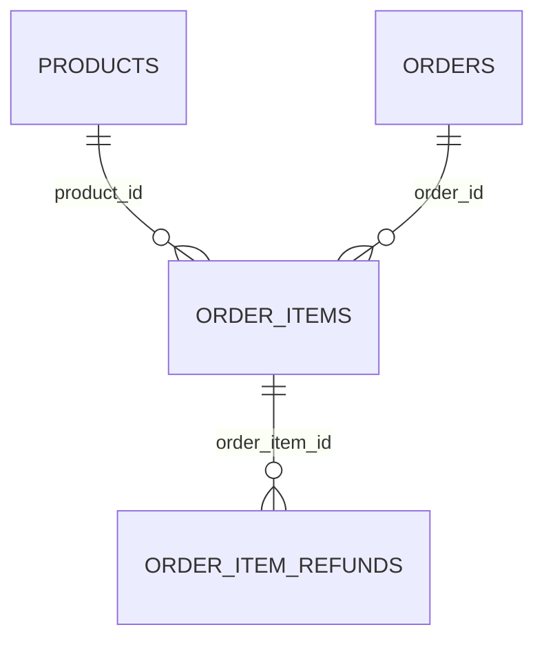

<div align="center">

# 🧸 Toylytics — E-Commerce Sales Analytics

**From raw transactions to business insights: Excel → SQL → Python → Power BI**


</div>

Toylytics is an end-to-end E-Commerce Sales Analytics project built using **Excel, SQL, Python, and Power BI**. The project transforms raw transactional data into business-ready KPIs, analysis, visualizations, and an interactive Power BI dashboard.

---

## 📑 Table of Contents

- [Project Objectives](#-project-objectives)
- [Tech Stack](#️-tech-stack)
- [Dataset](#-dataset)
- [Workflow](#-workflow)
- [Project Structure](#-project-structure)
- [Key Business Metrics](#-key-business-metrics)
- [Sales Analysis](#-sales-analysis)
- [Product Analysis](#-product-analysis)
- [Customer Analysis](#-customer-analysis)
- [Refund Analysis](#-refund-analysis)
- [Power BI Data Model](#-power-bi-data-model)
- [Core DAX Measures](#-core-dax-measures)
- [Power BI Dashboard](#-power-bi-dashboard)
- [Key Insights](#-key-insights)
- [Skills Demonstrated](#-skills-demonstrated)
- [Project Outcome](#-project-outcome)
- [Author](#-author)

---

## 📌 Project Objectives

| # | Objective |
|:-:|-----------|
| 1 | Measure sales and profitability |
| 2 | Analyze monthly sales trends |
| 3 | Identify top-performing products |
| 4 | Understand customer purchasing behavior |
| 5 | Compare one-time and repeat customers |
| 6 | Analyze refunds and refund rates |
| 7 | Build an interactive Power BI dashboard |

---

## 🛠️ Tech Stack

| Tool | Purpose |
|------|---------|
| **Excel / Power Query** | Data cleaning and initial analysis |
| **SQL** | Data exploration and business analysis |
| **Python** | EDA, feature engineering and business analysis |
| **Pandas / NumPy** | Data manipulation and calculations |
| **Matplotlib / Seaborn** | Visualization |
| **Power BI** | Data modeling, DAX and dashboard |
| **Git / GitHub** | Version control |

---

## 📂 Dataset

The project contains four main tables:

| File | Description |
|------|-------------|
| `orders.csv` | Order-level information |
| `order_items.csv` | Item-level transaction information |
| `products.csv` | Product information |
| `order_item_refunds.csv` | Refund information |

---

## 🔄 Workflow



| Stage | Tool | Output |
|:-----:|------|--------|
| 1️⃣ Ingest | Raw CSV Data | Four source tables |
| 2️⃣ Prepare | Excel / Power Query | Cleaned and validated data |
| 3️⃣ Explore | SQL | Business analysis queries |
| 4️⃣ Analyze | Python | EDA and business analysis |
| 5️⃣ Model | Power BI | Data model and DAX measures |
| 6️⃣ Visualize | Power BI | Interactive dashboard |
| 7️⃣ Deliver | — | Business insights |

---

## 📁 Project Structure

```text
Toylytics/
├── data/
│   └── raw/
│       ├── orders.csv
│       ├── order_items.csv
│       ├── products.csv
│       └── order_item_refunds.csv
├── excel/
│   └── Toylytics_Analysis.xlsx
├── sql/
│   └── SQL_Analysis.sql
├── python/
│   ├── notebooks/
│   │   ├── 01_data_preparation.ipynb
│   │   ├── 02_exploratory_data_analysis.ipynb
│   │   ├── 03_business_analysis.ipynb
│   │   └── 04_final_insights.ipynb
│   ├── scripts/
│   │   ├── data_loader.py
│   │   ├── data_preparation.py
│   │   └── analysis_utils.py
│   └── visualizations/
├── powerbi/
│   └── Toylytics_Dashboard.pbix
├── README.md
└── .gitignore
```

| Folder / File | Purpose |
|---------------|---------|
| `data/raw/` | Original source CSV files |
| `excel/` | Excel / Power Query cleaning and initial analysis |
| `sql/` | SQL exploration and business analysis |
| `python/notebooks/` | Step-by-step notebooks: preparation → EDA → business analysis → final insights |
| `python/scripts/` | Reusable Python modules for loading, preparing and analyzing data |
| `python/visualizations/` | Charts generated with Matplotlib / Seaborn |
| `powerbi/` | Power BI data model, DAX and dashboard |

---

## 📊 Key Business Metrics

| KPI | Result |
|-----|-------:|
| 🛒 Total Orders | **32,313** |
| 👥 Total Customers | **31,696** |
| 📦 Total Items Sold | **40,025** |
| 💵 Total Revenue | **$1,938,509.75** |
| 🏭 Total COGS | **$722,370.25** |
| 💰 Total Profit | **$1,216,139.50** |
| 🧾 Average Order Value | **$59.99** |
| 📈 Profit Margin | **62.74%** |
| ↩️ Total Refund Records | **1,731** |
| 💸 Total Refund Amount | **$85,338.69** |
| 🔁 Refunded Orders | **1,723** |
| 📉 Refund Rate | **5.33%** |

---

## 📈 Sales Analysis

| Metric | Result |
|--------|--------|
| 🥇 Highest revenue month | December 2014 |
| Highest monthly revenue | $144,823.02 |
| 🔻 Lowest revenue month | March 2012 |
| Lowest monthly revenue | $2,999.40 |
| 🥇 Highest monthly profit month | December 2014 |
| Highest monthly profit | $91,857.00 |

---

## 🏆 Product Analysis

| Category | Product | Value |
|----------|---------|------:|
| 💵 Top Revenue Product | The Original Mr. Fuzzy | Revenue: $1,211,057.74 |
| 💰 Top Profit Product | The Original Mr. Fuzzy | Profit: $738,893.00 |
| 📦 Most Sold Product | The Original Mr. Fuzzy | Units Sold: 24,226 |
| 📈 Highest Margin Product | The Birthday Sugar Panda | Profit Margin: 68.49% |

---

## 👥 Customer Analysis

| Customer Type | Customers | Revenue |
|---------------|----------:|--------:|
| One-time Customers | 31,105 | $1,864,153.31 |
| Repeat Customers | 591 | $74,356.44 |

> **Top customer**
> - Customer ID: `341972`
> - Revenue: `$251.94`

---

## 💰 Refund Analysis

| Metric | Result |
|--------|-------:|
| Total refund records | 1,731 |
| Total refund amount | $85,338.69 |
| Refunded orders | 1,723 |
| Refund rate | 5.33% |
| Highest refund product | The Original Mr. Fuzzy |
| Highest refund amount | $61,837.63 |

---

## 🧮 Power BI Data Model



**Main relationships**

| From (1) | | To (*) | Cardinality |
|----------|:-:|--------|:-----------:|
| `orders[order_id]` | ➜ | `order_items[order_id]` | 1 : * |
| `products[product_id]` | ➜ | `order_items[product_id]` | 1 : * |
| `order_items[order_item_id]` | ➜ | `order_item_refunds[order_item_id]` | 1 : * |

---

## 📐 Core DAX Measures

```dax
Total Revenue =
SUM('order item'[price_usd])

Total COGS =
SUM('order item'[cogs_usd])

Total Profit =
[Total Revenue] - [Total COGS]

Profit Margin =
DIVIDE([Total Profit], [Total Revenue], 0)

Total Orders =
DISTINCTCOUNT('order'[order_id])

Total Customers =
DISTINCTCOUNT('order'[user_id])

Average Order Value =
DIVIDE([Total Revenue], [Total Orders], 0)
```

---

## 📊 Power BI Dashboard

The dashboard is organized around three pages:

<table>
<tr>
<td valign="top" width="33%">

**1️⃣ Executive Sales Dashboard**

- Revenue
- Profit
- Profit Margin
- Orders
- Customers
- Average Order Value
- Monthly Revenue
- Monthly Profit

</td>
<td valign="top" width="33%">

**2️⃣ Product & Customer Analysis**

- Top products by revenue
- Top products by profit
- Units sold
- One-time vs repeat customers
- Customer revenue contribution

</td>
<td valign="top" width="33%">

**3️⃣ Refund Analysis**

- Refund amount
- Refund rate
- Refunded orders
- Refunds by product
- Refund trends

</td>
</tr>
</table>

---

## 🔍 Key Insights

1. The dataset contains **32,313 orders** and **31,696 customers**.
2. Total revenue is approximately **$1.94M**.
3. Total profit is approximately **$1.22M**, with a calculated margin of **62.74%**.
4. **The Original Mr. Fuzzy** generated the highest revenue, profit, and unit sales.
5. **The Birthday Sugar Panda** had the highest calculated profit margin at **68.49%**.
6. Most customers were one-time customers.
7. **December 2014** recorded the highest monthly revenue and profit.
8. Total refund value was **$85,338.69**.
9. **The Original Mr. Fuzzy** had the highest refund amount at **$61,837.63**.

---

## 🚀 Skills Demonstrated

| Data & Analysis | Tools & Modeling | Delivery |
|-----------------|------------------|----------|
| Data cleaning and validation | SQL joins and aggregations | Data visualization |
| Exploratory Data Analysis | Python data analysis | Power BI dashboard development |
| KPI development | Power Query | Business storytelling |
| Customer analysis | Data modeling | Git/GitHub project organization |
| Product analysis | DAX | |
| Refund analysis | | |

---

## 🎯 Project Outcome

Toylytics demonstrates a complete analytics workflow from raw e-commerce transactions to an interactive business intelligence dashboard. It combines Excel, SQL, Python, and Power BI to convert raw data into structured analysis and business insights.

---

## 👨‍💻 Author

**Suyash Verma**
BCA — Data Science & AI

**Focus Areas:**
- Data Analytics
- Data Science
- Machine Learning
- Business Intelligence

---

## ⭐ Project Status

**Completed** — `Excel → SQL → Python → Power BI`
